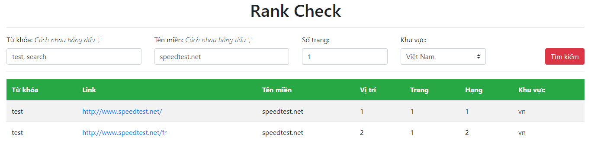

# Rank Check
Kiểm tra thứ hạng từ khóa bằng việc thu thập kết quả của [Google](https://www.google.com) và [Bing](https://www.bing.com). Công cụ này được viết dựa trên [Scrapy](https://scrapy.org) và [PHP](http://www.php.net). Có 2 phiên bản dành cho giao diện web và command line để kết nối lưu dữ liệu trực tiếp lên [MySQL](https://www.mysql.com) database.

## Update
### Ngày 06/08/2018
- Cho phép Giao diện web kết nối database để cập nhật kết quả crawl về.
- Tạo thêm bảng [rankcrawl](https://github.com/npthinh1996/rankcheck/blob/dc7a323ed352fa06aaa7557be270856318bcb3ba/create.sql#L27) để lưu dữ liệu.

## Tùy chỉnh
### Yêu cầu
- [Python 3](https://www.python.org)
- [Scrapy](https://scrapy.org)
- [PyMySQL](https://pypi.org/project/PyMySQL)

### Cài đặt
Lệnh cài đặt dùng cho hosting chạy Linux
- Cập nhật các package trước khi cài đặt:
```sh
$ sudo apt update
$ sudo apt upgrade
```
- Cài đặt python 3 và trình quản lý gói cho python:
```sh
$ sudo apt install python3 python3-pip
```
- Cài đặt [Scrapy](https://scrapy.org) và [PyMySQL](https://pypi.org/project/PyMySQL):
```sh
$ pip install scrapy
$ pip install pymysql
```
- Tải về source code từ Github và bắt đầu làm việc tại thư mục `rankcheck`:
```sh
$ git clone https://github.com/npthinh1996/rankcheck.git
$ cd rankcheck
```

### Proxy
Mặc định proxy được tắt, để sử dụng cần phải bỏ comment mục Middlewares tại [setting.py](https://github.com/npthinh1996/rankcheck/blob/14df0a686f3437913299765a85e1bacbe6acf18f/rankCheck/settings.py#L50), code quản lý proxy tại hàm [process_request](https://github.com/npthinh1996/rankcheck/blob/14df0a686f3437913299765a85e1bacbe6acf18f/rankCheck/middlewares.py#L71) và cập nhật lại list proxy tại [proxy.txt](https://github.com/npthinh1996/rankcheck/blob/master/proxy.txt) theo format:
>IP1:PORT1
>
>IP2:PORT2
>
>...

Có thể sử dụng smart proxy bằng tool trả phí [Crawlera](https://scrapinghub.com/crawlera) và tùy chỉnh lại file [setting.py](https://github.com/npthinh1996/rankcheck/blob/master/rankCheck/settings.py) theo [hướng dẫn](https://support.scrapinghub.com/support/solutions/articles/22000188399-using-crawlera-with-scrapy).

Để kiểm tra proxy hoạt động, chạy lệnh:
```sh
$ scrapy crawl proxyTest --nolog
```
Kết quả trả về là IP phân tích từ trang [whatismyipaddress](https://whatismyipaddress.com).

## Phiên bản Web
Cho phép người dùng nhập `Từ khóa`, `Tên miền`, chọn `Số trang` và `Khu vực` để thu thập kết quả thứ hạng từ khóa.

### Tùy chỉnh
- Bỏ comment tại file [settings.py](https://github.com/npthinh1996/rankcheck/blob/dc7a323ed352fa06aaa7557be270856318bcb3ba/rankCheck/settings.py#L69) để cập nhật tự động kết quả crawl được lên database.
- Do trong quá trình chạy, tool có tạo thêm file tạm nên cần phải thiết lập lại permission cho thư mục `rankcheck` có quyền được ghi dữ liệu:
```sh
$ sudo chmod 777 rankcheck
```
- Để tránh việc ban IP nên theo mặc định, tool sẽ crawl kết quả từ trang [Bing](https://www.bing.com), để chuyển sang [Google](https://www.google.com) thì sửa lại code ở file [index.php](https://github.com/npthinh1996/rankcheck/blob/14df0a686f3437913299765a85e1bacbe6acf18f/index.php#L76).
- Sửa lại lệnh system trong file [index.php](https://github.com/npthinh1996/rankcheck/blob/14df0a686f3437913299765a85e1bacbe6acf18f/index.php#L103) để tool hoạt động trên Linux *(mặc định là Windows)*.

### Giao diện
Theo mặc định, web sẽ chạy theo đường dẫn `${yourdomain}`/index.php.

Trang chủ:


Seach từ khóa:


Search nhiều từ khóa và có tên miền:


## Phiên bản Command line
Được thiết kể để thu thập nhiều từ khóa và lưu trữ dữ liệu trực tiếp lên database.

### Tùy chỉnh
- Cập nhật lại kết nối đến database tại những file: [impKey.example.py](https://github.com/npthinh1996/rankcheck/blob/14df0a686f3437913299765a85e1bacbe6acf18f/impKey.example.py#L6), [pipelines.example.py](https://github.com/npthinh1996/rankcheck/blob/14df0a686f3437913299765a85e1bacbe6acf18f/rankCheck/pipelines.example.py#L14), [rankBCheck.example.py](https://github.com/npthinh1996/rankcheck/blob/14df0a686f3437913299765a85e1bacbe6acf18f/rankCheck/spiders/rankBCheck.example.py#L15), [rankGCheck.example.py](https://github.com/npthinh1996/rankcheck/blob/14df0a686f3437913299765a85e1bacbe6acf18f/rankCheck/spiders/rankGCheck.example.py#L13), sau đó xóa đuôi `.example`.
- Xóa comment mục Pipelines tại file [setting.py](https://github.com/npthinh1996/rankcheck/blob/d5636648b7e1c892464998e589bd110f88f9874e/rankCheck/settings.py#L68) để tool tự động cập nhật database mỗi khi chạy crawl từ khóa.
- Đặt lại `name` cho spider tại [rankBCheck.py](https://github.com/npthinh1996/rankcheck/blob/14df0a686f3437913299765a85e1bacbe6acf18f/rankCheck/spiders/rankBCheck.example.py#L11) và [rankGCheck.py](https://github.com/npthinh1996/rankcheck/blob/14df0a686f3437913299765a85e1bacbe6acf18f/rankCheck/spiders/rankGCheck.example.py#L9) dựa theo dòng comment được đặt ngay dưới.
- Để thay đổi số trang cần lấy cho mỗi từ khóa thì sửa lại code tại [rankBCheck.py](https://github.com/npthinh1996/rankcheck/blob/14df0a686f3437913299765a85e1bacbe6acf18f/rankCheck/spiders/rankBCheck.example.py#L50) và [rankGCheck.py](https://github.com/npthinh1996/rankcheck/blob/14df0a686f3437913299765a85e1bacbe6acf18f/rankCheck/spiders/rankGCheck.example.py#L50) *(mặc định sẽ lấy 3 trang cho mỗi từ khóa)*.

### Tạo database
Import file [create.sql](https://github.com/npthinh1996/rankcheck/blob/master/create.sql) để tạo database, cấu trúc table:
- keywords

| id | keyword |
| - | - |
| | |
- rankcheck

| keyId | url | domain | position | page | range | date | searchId |
| - | - | - | - | - | - | - | - |
| | | | | | | | |

### Import từ khóa
Chạy lệnh sau để import danh sách từ khóa từ file [key.txt](https://github.com/npthinh1996/rankcheck/blob/master/key.txt) lên database:
```sh
$ python3 impKey.py
```

### Crawl từ khóa
Chạy lệnh sau để tiến hành crawl từ khóa từ table `keywords` trên database và tự động insert kết quả vào table `rankcheck`:
- Kết quả từ [Bing](https://www.bing.com):
```sh
$ scrapy crawl rankBCheck
```
- Kết quả từ [Google](https://www.google.com):
```sh
$ scrapy crawl rankGCheck
```
Để xuất kết quả ra file `.json` thì thêm dòng `-o filename.json` sau mỗi lệnh.

<hr>
<b>© PT.9E</b>
