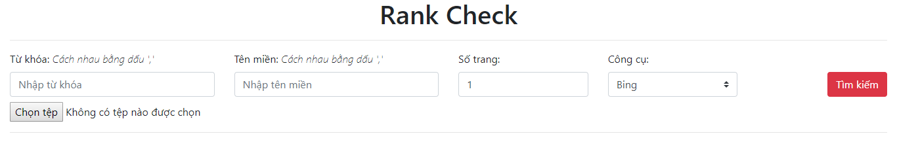

# Rank Check
Kiểm tra thứ hạng từ khóa bằng việc thu thập kết quả của [Google](https://www.google.com) và [Bing](https://www.bing.com). Công cụ này được viết dựa trên [Scrapy](https://scrapy.org) và [PHP](http://www.php.net) có hỗ trợ lưu dữ liệu trực tiếp lên [MySQL](https://www.mysql.com) database.

## Tùy chỉnh

### Yêu cầu
- [Python 3](https://www.python.org)
- [Scrapy](https://scrapy.org)
- [PyMySQL](https://pypi.org/project/PyMySQL)

### Cài đặt
Lệnh cài đặt dùng cho hosting chạy Linux
- Cập nhật các package trước khi cài đặt:
```sh
$ sudo apt update
$ sudo apt upgrade
```
- Cài đặt python 3 và trình quản lý gói cho python:
```sh
$ sudo apt install python3 python3-pip
```
- Cài đặt [Scrapy](https://scrapy.org) và [PyMySQL](https://pypi.org/project/PyMySQL):
```sh
$ pip install scrapy
$ pip install pymysql
```
- Tải về source code từ Github và bắt đầu làm việc tại thư mục `rankcheck`:
```sh
$ git clone https://github.com/npthinh1996/rankcheck.git
$ cd rankcheck
```

### Proxy
Mặc định proxy được tắt, để sử dụng cần phải bỏ comment mục Middlewares tại [setting.py](https://github.com/npthinh1996/rankcheck/blob/437fb2c8ec1c7ce2c7424dca8798c353271f6474/rankCheck/settings.py#L55), code quản lý proxy tại hàm [process_request](https://github.com/npthinh1996/rankcheck/blob/437fb2c8ec1c7ce2c7424dca8798c353271f6474/rankCheck/middlewares.py#L71) và cập nhật lại list proxy tại [proxy.txt](https://github.com/npthinh1996/rankcheck/blob/master/proxy.txt) theo format:
>IP1:PORT1
>
>IP2:PORT2
>
>...

Có thể sử dụng smart proxy bằng tool trả phí [Crawlera](https://scrapinghub.com/crawlera) và tùy chỉnh lại file [setting.py](https://github.com/npthinh1996/rankcheck/blob/master/rankCheck/settings.py) theo [hướng dẫn](https://support.scrapinghub.com/support/solutions/articles/22000188399-using-crawlera-with-scrapy).

Để kiểm tra proxy hoạt động, chạy lệnh:
```sh
$ scrapy crawl proxyTest --nolog
```
Kết quả trả về là IP4, IP6 và Region phân tích từ trang [whatismyipaddress](https://whatismyipaddress.com).

## Giao diện
Cho phép người dùng nhập `Từ khóa`, `Tên miền`, chọn `Số trang` và `Công cụ` để thu thập kết quả thứ hạng từ khóa.

Người dùng có thể import danh sách keyword bằng file `.csv`, chương trình sẽ ưu tiên chọn keyword từ file (nếu có) để crawl kết quả.

### Tùy chỉnh
- Bỏ comment tại file [settings.py](https://github.com/npthinh1996/rankcheck/blob/437fb2c8ec1c7ce2c7424dca8798c353271f6474/rankCheck/settings.py#L67) để cập nhật tự động kết quả crawl được lên database.
- Đổi tên file [pipelines.example.py](https://github.com/npthinh1996/rankcheck/blob/master/rankCheck/pipelines.example.py) thành `pipelines.py` và tùy chỉnh lại kết nối đến database.
- Do trong quá trình chạy, tool có tạo thêm file tạm nên cần phải thiết lập lại permission cho thư mục `rankcheck/tmp` có quyền được tạo mới file:
```sh
$ sudo chmod 757 rankcheck/tmp
```

### Giao diện
Theo mặc định, web sẽ chạy theo đường dẫn `${yourdomain}`/index.php.

Trang chủ:


Seach từ khóa:


Search từ file `.csv`:


### Tạo database
Import file [create.sql](https://github.com/npthinh1996/rankcheck/blob/master/create.sql) để tạo database, cấu trúc table:

- rankcrawl

| keyword | url | domain | rank | date |
| - | - | - | - | - |
| | | | | |

Lệnh trên hosting:

```sh
$ mysql -u root -p < create.sql
```
Sau đó nhập mật khẩu để hoàn tất tạo mới database.

<hr>
<b>© PT.9E</b>
